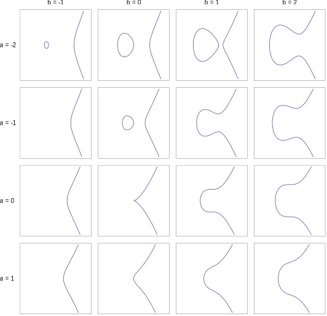
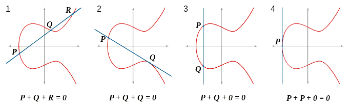
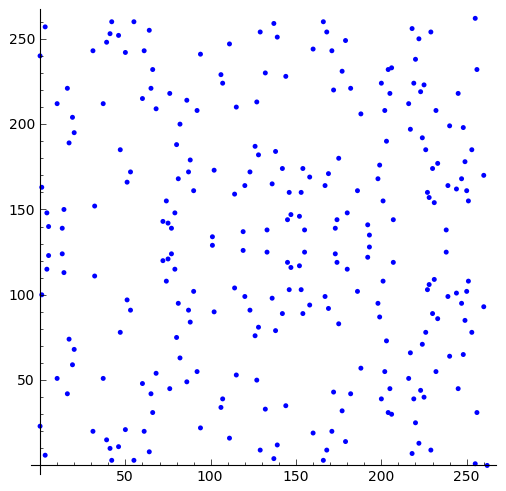

% Elliptic-curve Cryptography and ECDSA
% Haskell Exchange 2017
% Thomas Dietert

# Elliptic-curve Cryptography

An approach to public-key cryptography based on the algebraic structure of
elliptic curves over finite fields

. . .

* Smaller keys (fewer bytes) compared to non-ECC public key cryptography
* Domain is over Galois fields (Finite fields)

# Elliptic Curves

A general form of an **elliptic curve** is the equation 

$$
y^{2} = x^{3} + ax + b
where 4^{3} 4a^{3} + 27b^{2} \neq 0
$$

. . .

This is know as _Weierstrass normal form_ (ECs can be defined with different equations)

 

# Elliptic Curves - Group laws

In mathematics, a *group* is an algebraic structure consisting of a set of
elements over which an operation $\oplus$ that combines any two elements of the set
to form a third element within the set (closure property). 

. . .

The following *group axioms* must also hold:

. . .

**Closure**

: $\forall a, b \in G. a \oplus b \in G$

**Associativity**

: $\forall a, b, c \in G. a \oplus b) \oplus c = a \oplus (b \oplus c)$

**Identity**

: $\exists e, \forall a \in G. e \oplus a = a \oplus e = a$

**Inverse**

: $\forall a, \exists b \in G. a \oplus b = b \oplus a = e$

. . .

A *group* can be defined for elliptic curves

# Elliptic Curve - Group

Let $O$ be the _point at infinity_, the **identity** element of the group.

Note: _The reason why this is called the "point at infinity" is beyond the scope
of this talk._

. . .

The **inverse** of a point $P = (x,y)$ is $P^{-1} = (x,-y)$ (the point is
reflected over the y-axis, and can also be written $-P$)

. . .

The **$\oplus$** operator (addition) is defined to be, given three points $P, Q,
R$ on the elliptic curve, $P + Q + R = O$.

. . .

From this equation we can intuitively show associativity and commutativity:

$$P + (Q + R) = (P + Q) + R = Q + (P + R) = (Q + P) + R = ... = O$$

Given these properties shown, we have defined an *abelian group*, and we can
therefore clarify the meaning $\oplus$:

$$P + Q = -R$$

... or for clarity: $P + Q + R^{-1} = 0$ such that $P + Q = R$

 

# Elliptic Curves over Finite Fields

An **Elliptic Curve** over a finite field $\mathbb{F}_p$ is defined by a 6 tuple:
$$(p,a,b,G,n,h)$$ 

Now $(x,y)\in\mathbb{F}_p$ written as $E(\mathbb{F}_p)$

The curve's domain is defined by $(x,y)$ such that $x,y \in \mathbb{F}_p$


```
where
  p = large prime 
  a = curve polynomial coefficient
  b = curve polynomial coefficient
  G = generator base point
  n = order (number of points in the group)                        
  h = cofactor      
```

But wait, they actually look like this!

 

. . .

For $E(\mathbb{F}_p)$ curves with prime order, _all_ points except 
the point at *inifinity* are generator points. 

# Elliptic Curve Public/Private Keys

. . .

Points in $E(\mathbb{F}_p)$ can be multiplied by a scalar $k \in \mathbb{F}_p$

. . .

A *Private Key* in ECC is defined by a random scalar $k \in \mathbb{F}_p$

. . .

A *Public Key* in ECC is defined by a point $Q = kG$ where $G$ is the generator
point.

. . .

## ECDLP 

. . .

The *Discrete Log Problem* for ECC states that it is computationally infeasable
to find $k$ given $Q = kG$ in $E(\mathbb{F}_p)$

. . .

This is how private keys stay private!

# ECDSA

-- Overview

# ECDSA - Sign

-- Copy slide from Nanocoin

# ECDSA - Sign (cont)

-- Haskell implementation

# ECDSA - Verify 

-- Copy slide from Nanocoin

# ECDSA - Verify (cont)

-- Haskell implementation (TODO)
 
# Example

-- Define a `Block` and derive Generic, Serialize instance
-- Generate a key pair
-- Sign the serialized block with private key
-- Verify the block with public key & data
